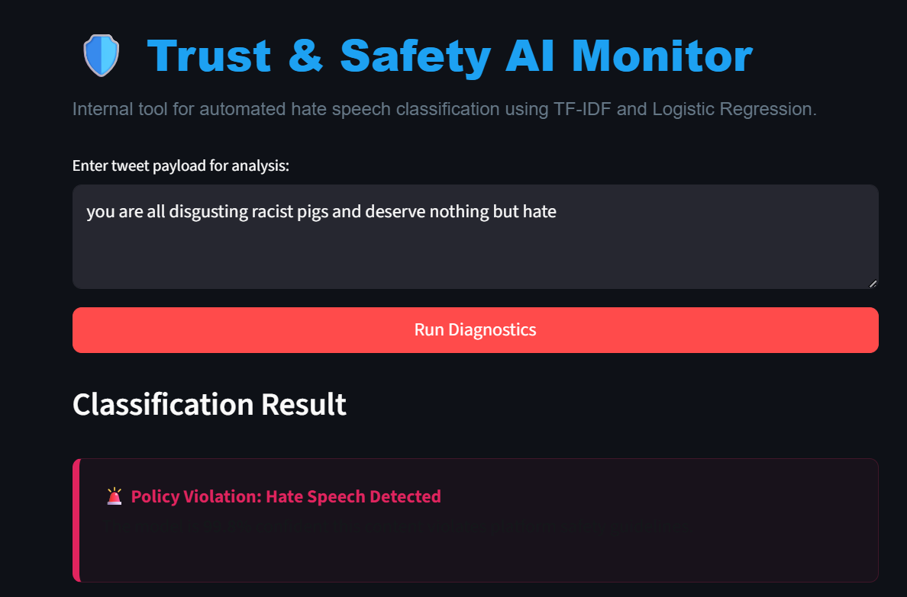
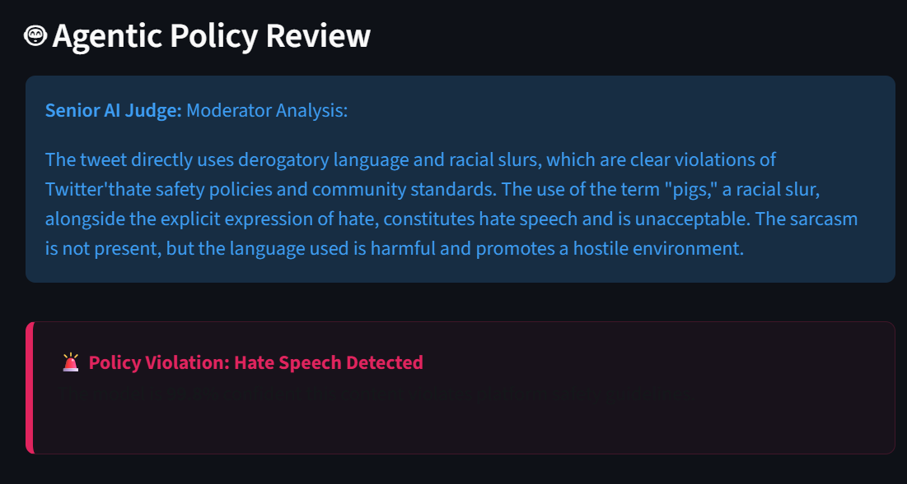
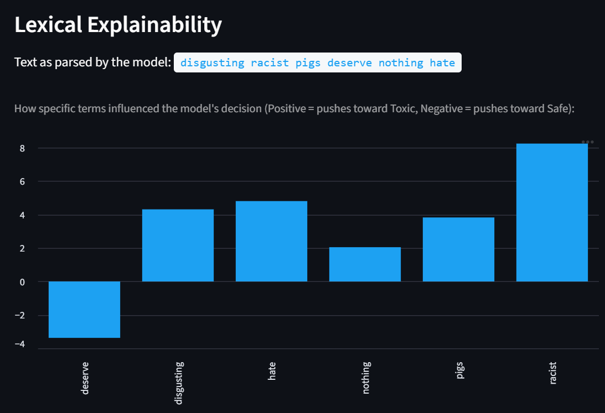
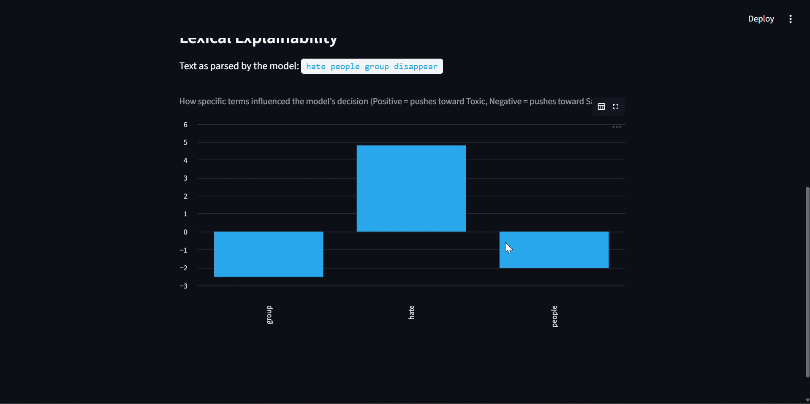

# 🛡️ Twitter Hate Speech Detection — NLP Pipeline

[](https://github.com/prakhar-189/Twitter-HateSpeech-NLP/actions/workflows/ci.yml)

An end-to-end NLP system for detecting hate speech in tweets, combining a classical machine learning pipeline with a Streamlit web interface and an agentic LLM layer for deeper context analysis.

---

## Overview

This project tackles automated hate speech classification on Twitter (X). It uses **TF-IDF vectorization** and **Logistic Regression** as the core classifier, augmented by a **local LLM agent** (via LangChain + Ollama) that acts as a "Senior Trust & Safety Judge" to provide nuanced, natural-language explanations for borderline or flagged content.

The system is designed as an internal moderation tool — not just a binary classifier, but an explainable pipeline that surfaces *why* a tweet was flagged.

---

## 📊 Results (real, measured on held-out test data)

Trained on the dataset described in [Dataset](#-dataset) below (31,962 tweets, 20% held out for testing, stratified). All three model variants are evaluated on the **same test set**, so the comparison is meaningful:

| Model | Accuracy | Precision | Recall | F1 | Confusion Matrix (TN / FP / FN / TP) |
|---|---|---|---|---|---|
| Baseline Logistic Regression | 0.953 | 0.905 | 0.362 | 0.517 | 5928 / 17 / 286 / 162 |
| Class-balanced Logistic Regression | 0.923 | 0.472 | 0.779 | 0.588 | 5554 / 391 / 99 / 349 |
| **Grid-searched best model (C=10, L2, balanced)** | 0.933 | 0.513 | 0.763 | **0.614** | 5620 / 325 / 106 / 342 |

Grid search tunes both `C` and `penalty` (`l1`/`l2`, via a `liblinear` solver) — L2 won, per `models/eval_metrics.json`'s `best_grid_search_params`.

**Honest read of these numbers:** the baseline looks great on accuracy (0.953) but that's almost entirely because only ~7% of tweets are labeled toxic — it only catches **36% of actual hate speech** (162 of 448 in the test set). Balancing the class weights roughly doubles recall to 78%, at the cost of precision dropping to 0.47 (nearly 1 in 2 flagged tweets is a false positive). The grid-searched model lands in between, optimizing F1. **Which of these three you'd actually deploy depends on the moderation policy**: a platform that wants to minimize missed hate speech would pick the balanced model despite its false-positive cost; one that wants to minimize wrongly-flagged content would pick the baseline. This tradeoff — not a single "accuracy" number — is the real result of this project.

### A real, documented success case

Testing the deployed app end-to-end with `"you are all disgusting racist pigs and deserve nothing but hate"` (99.8% toxic probability):



This also triggers the LLM secondary review (`OLLAMA_MODEL=phi3:mini` — see the LLM Agent section under [How It Works](#how-it-works)), which produces a genuine natural-language moderator explanation, not a canned string:



And the lexical explainability chart shows *why* — `racist` alone contributes roughly double the toxic-push of any other single word:



### Two real, documented failure modes

**1. Vocabulary gap.** The same session, the tuned model classified **"I hate all people from that group, they should just disappear"** as **83% safe** — a clear miss on an unambiguous example of hate speech:



Digging into why (`tfidf_vectorizer.vocabulary_` + `model.predict_proba`):
- After preprocessing, the tweet reduces to the tokens `hate`, `people`, `group`, `disappear`.
- **`disappear` — arguably the most alarming word in the sentence — isn't in the model's 5,000-term TF-IDF vocabulary at all**, so it contributes zero signal.
- The remaining tokens (`hate`, `people`, `group`) are extremely generic and appear across large numbers of *non*-toxic tweets in the training data too (e.g. "I hate Mondays"), so individually their learned weights don't push the prediction toward toxic.

A second paraphrase — *"I just hate this specific group of people, I pray they just go somewhere else and kill each other"* — scored even lower (**0.66% toxic**) despite every word except `specific` being in-vocabulary, including `kill`. That rules out "missing vocabulary" as the only explanation: individually common words like `hate`, `pray`, and `kill` apparently carry near-zero or safe-leaning learned weight on their own, because the model has no way to compose their combined meaning — only sum independent per-token weights.

**2. Topic vs. stance confusion (shortcut learning).** Checking the model's *most confident* held-out test-set "toxic" predictions surfaced something more concerning than a vocabulary gap: several of the highest-confidence hits (~100%) were **news or commentary tweets about racism, not hateful content themselves** — e.g. *"Cuomo: Paladino's 'racist, ugly' comments on the Obamas embarrass New Yorkers"* and *"Montana says no to racism"* (an anti-racism statement) both scored ~100% toxic. The success-case chart above is consistent with this: `racist` alone contributes roughly 2x the weight of any other token. **The model appears to key heavily on the presence of topical words like "racist"/"racism", largely independent of whether the tweet condemns or commits the behavior** — a shortcut-learning pattern, not genuine stance detection.

Together, these two failure modes are the strongest argument in this repo for why a semantic model (a fine-tuned transformer, or using the LLM as the primary classifier rather than only a secondary reviewer for already-flagged content) would generalize better than bag-of-words TF-IDF — see [Limitations & Next Steps](#-limitations--next-steps).

Full metrics: [`models/eval_metrics.json`](models/eval_metrics.json), reproducible via `python main.py`.

---

## 📦 Dataset

[Twitter Sentiment Analysis (Hate Speech)](https://www.kaggle.com/datasets/arkhoshghalb/twitter-sentiment-analysis-hatred-speech) — originally a Simplilearn/Analytics Vidhya NLP course dataset (`data/Dataset.csv`, columns `id`, `label`, `tweet`).

- **31,962 tweets**, labeled `1` = hate speech / `0` = not, **7.0% positive class** (2,242 vs 29,720) — this imbalance is exactly why the baseline/balanced/tuned comparison above matters.
- Not committed to this repo (gitignored — see `.gitignore`) since it's a redistributable-but-external dataset; download it from the link above and place it at `data/Dataset.csv` (columns must match `tweet`/`label`, adjust `src/preprocess.py` if using a different schema).

---

## Features

- **NLP preprocessing pipeline** — cleans raw tweet text (strips URLs, mentions, hashtags, stopwords)
- **TF-IDF + Logistic Regression** — fast, interpretable baseline classifier
- **Class imbalance handling** — trains a balanced model to address skewed label distributions
- **Hyperparameter tuning** — Grid Search with Stratified K-Fold cross-validation to find the optimal model
- **Consistent evaluation** — all model variants scored on the same held-out test set (accuracy, precision, recall, F1, confusion matrix), persisted to `models/eval_metrics.json`
- **Model persistence** — saves the best model and vectorizer as `.pkl` artifacts via `joblib`
- **Streamlit UI** — interactive web app to classify arbitrary tweet text in real time
- **Lexical explainability** — visualizes per-term TF-IDF coefficients to show what drove each prediction
- **LLM agentic review** — routes flagged or borderline tweets to a local LLaMA 3 model (via the current `langchain-ollama` integration) for a 2–3 sentence policy violation explanation, with a request timeout so a hung local Ollama server can't freeze the UI

---

## Project Structure

```
Twitter-HateSpeech-NLP/
│
├── src/
│   ├── preprocess.py       # Data loading, tweet cleaning, TF-IDF vectorization
│   ├── train.py            # Baseline model, balanced model, Grid Search tuning
│   └── evaluate.py         # Model evaluation (accuracy/precision/recall/F1 + confusion matrix)
│
├── tests/                  # pytest suite: preprocessing + evaluation correctness
├── .github/workflows/ci.yml
├── Dockerfile
│
├── data/
│   └── Dataset.csv         # Tweet dataset (not included — see Dataset section)
│
├── models/                 # Generated after running main.py
│   ├── tfidf_vectorizer.pkl
│   ├── best_model.pkl
│   └── eval_metrics.json   # Real accuracy/precision/recall/F1/confusion-matrix per model variant
│
├── main.py                 # Orchestrates the full training + evaluation pipeline
├── app.py                  # Streamlit web application
├── llm_agent.py             # LangChain + Ollama LLM reviewer
├── requirements.txt
├── requirements-dev.txt
├── pyproject.toml
├── Problem Statement.pdf
├── .gitignore
└── LICENSE
```

---

## How It Works

### Training Pipeline (`main.py`)

1. **Load & Preprocess** — reads `data/Dataset.csv`, cleans tweet text, and produces TF-IDF feature matrices for train/test splits (80/20, stratified).
2. **Train** — fits a baseline Logistic Regression and a class-balanced variant.
3. **Hyperparameter Tuning** — Grid Search with Stratified K-Fold CV over the regularization strength `C`.
4. **Evaluate** — scores baseline, balanced, and the tuned best model **all on the same held-out test set** (previously the first two were only evaluated on the training set, which doesn't say anything about generalization), then saves the vectorizer, model, and `eval_metrics.json`.

### Streamlit App (`app.py`)

- Accepts raw tweet text as input.
- Preprocesses → vectorizes → classifies using the saved model.
- Displays a styled result card (🚨 toxic / ✅ safe) with a confidence percentage.
- Shows a bar chart of the top TF-IDF coefficient contributions (lexical explainability).
- For **toxic** predictions or **borderline safe** predictions (toxic probability > 40%), automatically routes to the LLM agent for a secondary review.

### LLM Agent (`llm_agent.py`)

Uses **LangChain** (via the `langchain-ollama` package) with a local **Ollama** server (default model: `llama3`) to run a "Trust & Safety Moderator" persona, with a 30-second request timeout. The agent is prompted to provide a 2–3 sentence explanation of *why* the content might violate platform policies, and whether sarcasm, reclaimed language, or slang may have caused a misclassification.

---

## Setup

### Prerequisites

- Python 3.9+
- [Ollama](https://ollama.com/) installed and running locally with the `llama3` model pulled:
  ```bash
  ollama pull llama3
  ```

### Installation

```bash
git clone https://github.com/prakhar-189/Twitter-HateSpeech-NLP.git
cd Twitter-HateSpeech-NLP

python -m venv venv
venv\Scripts\activate        # source venv/bin/activate on Linux/Mac
pip install -r requirements.txt
```

### Dataset

Download the dataset from the link in [Dataset](#-dataset) above and place it as `data/Dataset.csv` (columns `id`, `label`, `tweet`).

---

## Usage

### Step 1 — Train the Model

```bash
python main.py
```
Preprocesses the data, trains and tunes the model, evaluates all three variants on the test set, and saves `models/tfidf_vectorizer.pkl`, `models/best_model.pkl`, and `models/eval_metrics.json`.

### Step 2 — Launch the App

```bash
streamlit run app.py
```
Open the URL shown in your terminal (typically `http://localhost:8501`), paste or type a tweet, and click **Run Diagnostics**.

> **Note:** The LLM agent requires Ollama running locally. If unavailable, the ML classifier still works — the LLM step surfaces a clear error instead of hanging.

### Docker
```bash
docker build -t twitter-hate-speech .
docker run -p 8501:8501 -v "${PWD}/models:/app/models" twitter-hate-speech
```

### Tests
```bash
pip install -r requirements-dev.txt
pytest tests/ -v      # preprocessing correctness (URL/handle/stopword/hashtag stripping)
                       # + evaluate_model correctness (incl. a single-class confusion-matrix edge case)
ruff check src tests llm_agent.py main.py app.py
```
CI (`.github/workflows/ci.yml`) runs both on every push/PR.

---

## 🐛 Real issues this pass fixed

- **Evaluation methodology bug**: `main.py` used to evaluate the baseline and balanced models on the **training set** and only the final tuned model on the test set — so there was no actual apples-to-apples comparison of whether balancing or tuning improved generalization. All three are now evaluated identically on the same held-out test set.
- **Missing precision and confusion matrix**: `evaluate.py` only reported accuracy/recall/F1. For a moderation tool, the false-positive vs. false-negative tradeoff is the actual decision that matters and neither was visible before.
- **`confusion_matrix()` edge case**: without `labels=[0, 1]`, scikit-learn's confusion matrix silently collapses to a 1×1 matrix if a batch happens to contain only one class, breaking the 4-value unpack — caught by a unit test, fixed with explicit labels.
- **Deprecated LangChain import**: `llm_agent.py` used `langchain_community.llms.Ollama`, which has moved to the dedicated `langchain-ollama` package (`OllamaLLM`) — updated, with `langchain-ollama` added to `requirements.txt`.
- **No LLM request timeout**: a hung local Ollama server used to freeze the Streamlit UI indefinitely behind a spinner. Now bounded to 30 seconds.
- **No metrics ever persisted**: `main.py` printed results to console and discarded them. Now written to `models/eval_metrics.json`.
- **Undocumented dataset**: README previously said "place your tweet dataset" with no name, size, or class balance. Now documented (Kaggle link, 31,962 rows, 7% positive class).
- **Grid search only tuned `C`**: the original problem statement asks for both `C` and `penalty`. Now tunes both (`liblinear` solver, `l1`/`l2`) — `l2` won, per `eval_metrics.json`.
- **Ollama host/model were hardcoded**: the Dockerfile used to imply `OLLAMA_HOST` was configurable when the code never read it. `llm_agent.py` now honors `OLLAMA_MODEL` and `OLLAMA_BASE_URL` env vars, and the Dockerfile comment matches what the code actually does.
- **Duplicate-word bug in the lexical explainability chart**: a repeated word in a tweet produced duplicate rows before `.set_index("Term")`, rendering oddly in `st.bar_chart`. Deduped with `set()`.
- **`nltk.download` ran on every import**: `preprocess.py` made a network call to NLTK's servers every time it was imported (including every test/CI run). Now checks `nltk.data.find(...)` first.

---

## ⚠️ Limitations & Next Steps

- **No semantic understanding**: TF-IDF + Logistic Regression is a bag-of-words model — it can't represent *who* is being targeted or *what* is being wished on them, only which tokens co-occurred with the toxic label during training. See the [documented failure modes](#two-real-documented-failure-modes) above for two concrete examples of this.
- **Shortcut learning on topical words**: the model's most confident predictions key heavily on words like "racist"/"racism" regardless of whether the tweet condemns or commits the behavior — it's closer to topic detection than stance/intent detection. This is a dataset-and-model-combination issue, not something a threshold tweak fixes.
- **Fixed 5,000-term vocabulary**: any word outside the top 5,000 TF-IDF terms (like `disappear` in the failure case) contributes zero signal, no matter how relevant it is.
- **The LLM agent is a secondary reviewer, not the primary classifier**: it only runs when the linear model's toxic probability crosses a threshold (>40% for "borderline"), so a confident-but-wrong miss (like the 0.66–17% toxic-probability failure cases) never reaches it at all. A stronger design would route based on model *uncertainty*, run the LLM as a second opinion more broadly, or replace the linear model with a fine-tuned transformer classifier that captures semantics and stance natively.
- **Precision/recall tradeoff is unresolved by design**: this repo reports three model variants rather than picking one "best" — an actual product would need a moderation-policy decision (deployed here as the grid-searched F1-optimal model by default) to pick a single operating point.
- **No live demo**: `app.py` degrades gracefully without Ollama (ML-only classification still works), which makes it deployable to Streamlit Community Cloud even without a hosted LLM — not yet done.

---

## Tech Stack

| Layer | Technology |
|---|---|
| Language | Python |
| ML / NLP | scikit-learn, NLTK |
| Data | pandas, NumPy |
| Model Persistence | joblib |
| Web App | Streamlit |
| LLM Integration | LangChain, langchain-ollama |
| Local LLM | Ollama (LLaMA 3) |
| Testing / CI | pytest, ruff, GitHub Actions |
| Containerization | Docker |

---

## License

This project is licensed under the [MIT License](LICENSE).

---

## Author

**Prakhar Srivastava**
[github.com/prakhar-189](https://github.com/prakhar-189)
